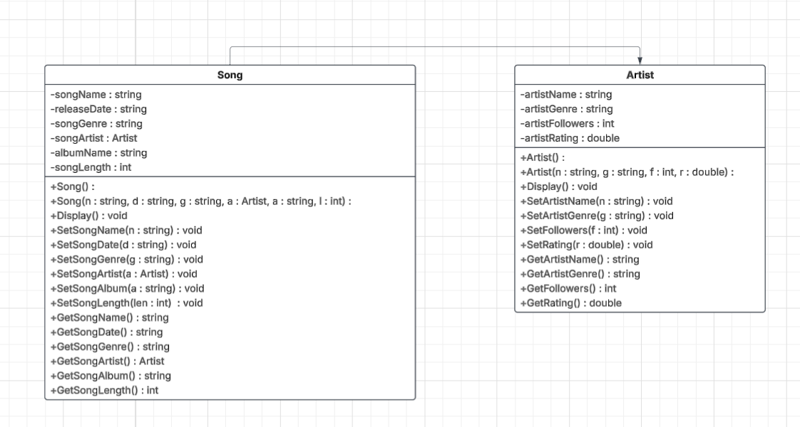

# Music Library

# Additional Classes

## Requirements
- Identify at least one new class that will be a derived class, inheriting from another base class. Use public inheritance to extend functionality.
- Ensure each class has a constructor and destructor. For classes involved in inheritance, ensure the constructor calls the base class constructor properly using an initializer list.
- Each new class should have a copy constructor. 
- Implement at least one virtual function in a base class that can be overridden by a derived class, enabling runtime polymorphism.
- Include private member variables and protected members if inheritance will be used, ensuring derived classes can access needed data.
- Add at least one friend function to a class, allowing external functions or other classes to access private members when necessary.
- Making one of the new classes abstract by including at least one pure virtual function, which must be overridden by any derived class.

